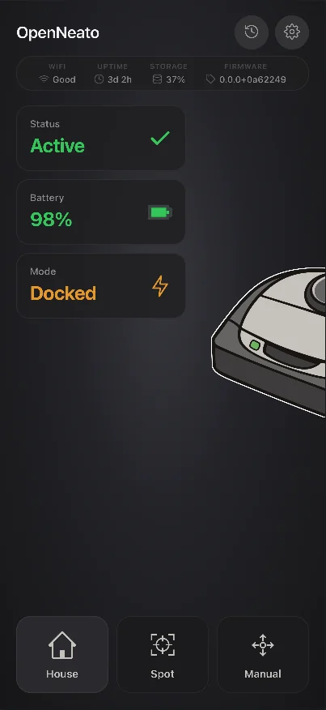
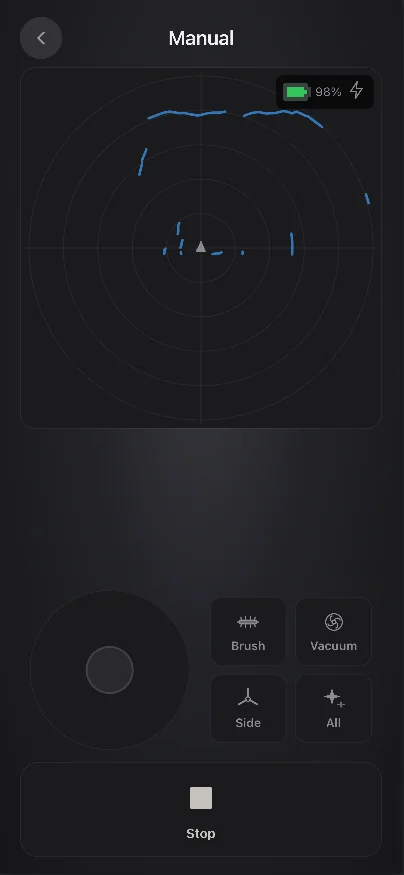
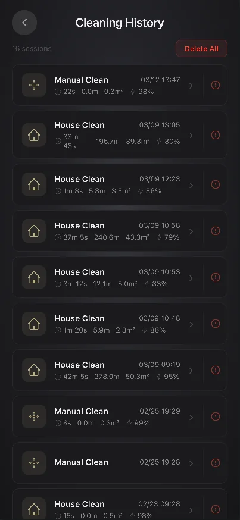
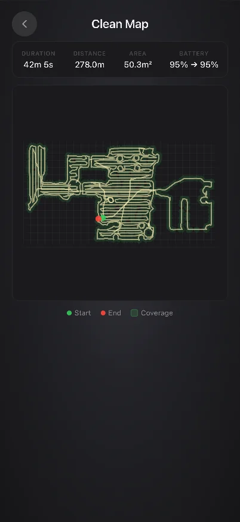
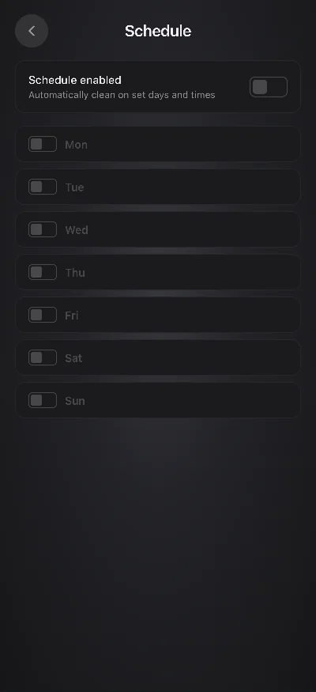
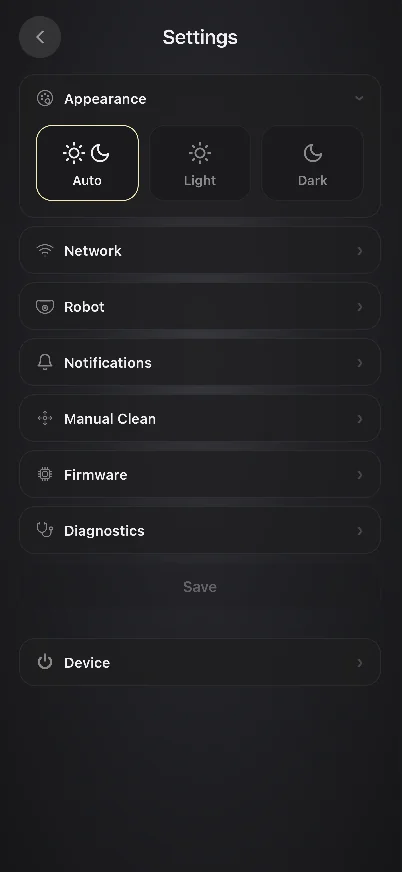

[](https://github.com/renjfk/OpenNeato/actions/workflows/ci.yml)
[](LICENSE)
[](https://github.com/renjfk/OpenNeato/releases/latest)
[](https://github.com/renjfk/OpenNeato/releases)

<p align="center">
 
</p>

# OpenNeato

Open-source replacement for Neato's discontinued cloud and mobile app. An ESP32 bridge communicates with
Botvac robots (D3-D7) over UART and exposes a local web UI over WiFi — no cloud, no app, no account required.

> [!NOTE]
> This is an early beta - things may break, rough edges are expected, and the API may change.
> If you run into problems, a [Discussion](https://github.com/renjfk/OpenNeato/discussions)
> or [issue](https://github.com/renjfk/OpenNeato/issues) is always welcome.

> [!IMPORTANT]
> **Now in development:**
[Guided Clean - zone cleaning, no-go lines, and map-based navigation](https://github.com/renjfk/OpenNeato/issues/68).
>
> Select zones on a previously recorded map, draw no-go lines, and let the robot clean exactly where you want.
> Follow the issue for progress updates and sub-task tracking.

> [!TIP]
> Want to get a feel for OpenNeato without hardware? Open the [live demo](https://openneato-demo.renjfk.com/).
> Demo states can be selected with `?scenario=...`; see [mock scenarios](docs/mock-scenarios.md).

|                Dashboard                 |                  Manual Drive                  |                    Cleaning History                    |
|:----------------------------------------:|:----------------------------------------------:|:------------------------------------------------------:|
|  |  |  |

|                Clean Map                 |                Schedule                |                Settings                |
|:----------------------------------------:|:--------------------------------------:|:--------------------------------------:|
|  |  |  |

## Motivation

Neato shut down their cloud services and mobile app, leaving perfectly functional robot vacuums without remote
control or scheduling. OpenNeato brings them back to life with a small ESP32 board wired to the robot's debug
port, giving you a local web interface that works without any external dependencies.

## Features

- **Dashboard** with live robot status, battery level, cleaning state, WiFi signal, and storage usage
- **House and spot cleaning** with pause/resume/stop/dock controls that adapt to the current state
- **Manual driving mode** with a virtual joystick, live LIDAR map visualization, motor toggles (brush, vacuum, side
  brush), bumper/wheel-lift/stall safety warnings
- **Live cleaning map** — watch the robot's path during an active cleaning session in the History view, rendered on a
  canvas with coverage overlay
- **7-day cleaning scheduler** with two slots per day, managed entirely on the ESP32 (doesn't use the robot's built-in
  schedule commands)
- **Cleaning history** with recorded robot paths rendered as coverage maps, session stats like duration, distance, area
  covered, and battery usage; individual session import/export for backup and restore
- **Push notifications** via [ntfy.sh](https://ntfy.sh); get notified when cleaning is done, an error occurs, a
  maintenance alert triggers, or the robot docks; fully optional, configurable per event
- **OTA firmware updates** from the browser with SHA-256 download verification (against published `checksums.txt`), MD5
  transfer integrity, dual-partition layout with auto-rollback, and automatic new version notifications when a release
  is available on GitHub
- **Settings page** for hostname, timezone, motor presets, notification topics, UART pins, theme (dark/light/auto),
  battery diagnostics (cycle count, voltage, temperature, and a "New Battery" calibration trigger), and more
- **Event logging** with configurable log levels (off/info/debug), compressed JSONL files on SPIFFS, browsable and
  downloadable from the UI; optional remote syslog (UDP) for long-running diagnostics without flash wear; logging is
  off by default
- **Factory reset** via 5-second button hold on the ESP32 or from the settings page
- **Robot clock sync** — pushes NTP time to the robot automatically, re-syncs every 4 hours
- **Flash tool** — standalone CLI that auto-detects the USB port, downloads the correct firmware from GitHub Releases,
  and flashes with zero prerequisites
- **Safety watchdog** — auto-stops wheels in manual mode if the browser disconnects; task and heap watchdogs restart the
  ESP32 on hangs
- **Crash recovery** — orphaned cleaning sessions after unexpected reboots are automatically recovered with full stats

The frontend is a lightweight SPA that gets gzipped and embedded directly into the firmware binary, so a single
OTA update covers both firmware and UI. Mobile-friendly, dark theme by default.

## Home Assistant Integration

This fork ships a HACS-installable Home Assistant custom integration in
[`custom_components/openneato/`](custom_components/openneato/). Once installed it discovers your OpenNeato bridge
by IP/hostname and exposes the robot as a full HA device — no YAML, no extra add-ons.

> [!NOTE]
> The HA integration is the primary differentiator of this fork. The firmware, frontend, and flash tool track
> upstream [`renjfk/OpenNeato`](https://github.com/renjfk/OpenNeato) closely. If you only want the standalone web
> UI, use upstream directly.

### Install via HACS

1. In HACS, add this fork as a **custom repository**: `https://github.com/Leicas/OpenNeato` (category:
   *Integration*).
2. Search for **OpenNeato** in HACS and install.
3. Restart Home Assistant.
4. **Settings → Devices & Services → Add Integration → OpenNeato** and enter the bridge hostname or IP
   (e.g. `neato.local` or `192.168.1.42`).

The integration polls `/api/*` over your LAN every 5 seconds (`local_polling`). No cloud round-trip, no
external dependencies. Requires firmware `1.0+`; battery diagnostics need firmware `0.13+` (upstream PR #121).

### What you get

A single device with the following entity groups:

- **Vacuum** (`vacuum.openneato_<name>`) — start/stop/pause/dock/locate/spot-clean, battery level, status,
  fan speed presets (Eco/Auto/Intense), error reporting. Works with all the standard vacuum cards.
- **Cameras** — `LIDAR map` (live 360° scan during cleaning) and `Cleaning replay` (animated GIF time-lapse
  of the most recent completed session). Both are standard HA camera entities, compatible with
  picture-entity, picture-glance, and vacuum-card.
- **Sensors** — battery level/voltage/current/temperature, battery cycle count, cumulative cleaning time,
  WiFi RSSI, free heap, storage used, uptime, motor RPMs, error code/message, plus "last clean" stats
  (duration, area covered, distance, battery used, mode, end time) pulled from the on-device history.
- **Binary sensors** — charging, external power, battery over-temp, battery failure, empty fuel, error
  active, NTP synced, dustbin seated, left/right wheel lifted, dock contact.
- **Switches** — eco mode, intense clean, bin-full detect, wall follower, schedule on/off, button-click
  sounds, melodies, warnings, stealth LED, remote syslog, WiFi AP fallback, and per-event push
  notifications (start/done/error/alert/docking).
- **Text** — syslog server IP, ntfy topic, ntfy server, ntfy token (full push-notification config from HA).
- **Numbers** — brush RPM, vacuum speed, side-brush power, stall threshold.
- **Select** — navigation mode (Normal / Gentle / Deep / Quick).
- **Buttons** — restart bridge, restart robot, shutdown robot, locate, clear errors, format filesystem
  (diagnostic, disabled by default), **new battery** (resets fuel-gauge calibration after a physical pack
  swap, disabled by default for safety).

Every entity is translated via `strings.json`, and diagnostic-class entities (voltages, currents, raw
sensor states) are tagged so they cluster cleanly under HA's Diagnostic section.

### Notes for setup

- **Camera entities and vacuum-card** — the `LIDAR map` camera self-manages a 2 s `/api/lidar` poll only
  while the robot is actively cleaning, so it doesn't add load to the coordinator's 5 s cycle. When idle,
  both cameras fall back to the most recent completed cleaning map.
- **Coordinator resilience** — the integration tolerates a single hung endpoint without going into
  "requires attention" state. State / charger / system are critical; anything else (errors, motors,
  history) falls back to the last known value during transient ESP32 serial hangs.
- **No Pillow declared dependency** — map rendering uses Pillow which already ships with HA Core, so the
  integration's `manifest.json` keeps `"requirements": []`. Nothing extra to install.
- **ntfy + custom servers** — point `ntfy_server` at a self-hosted instance and `ntfy_token` at a Bearer
  token for authenticated push. Empty server defaults to `ntfy.sh`; empty token is unauthenticated.

### Version history

Full per-version notes live in [`custom_components/openneato/CHANGELOG.md`](custom_components/openneato/CHANGELOG.md).
Highlights:

- **1.11** — added `notify_on_start` and `ap_fallback_on_disconnect` switches; ntfy topic/server/token text
  entities for full HA-side push config.
- **1.10** — battery diagnostics (current, voltage, cycles, cumulative cleaning time) on top of firmware
  PR #121, `New battery` calibration button, UTF-8-tolerant `/api/version` parsing.
- **1.9** — fixed cameras stuck on the idle placeholder (`get_encoding()` crash on streamed bodies).
- **1.6** — `Cleaning replay` camera (animated GIF time-lapse), `/api/history` corruption-tolerant parsing,
  history filename validation + 2 MB response cap (LAN-MITM mitigation).
- **1.3** — `LIDAR map` camera ported from the frontend renderer; self-managed polling.
- **1.2** — last-clean stats sensors; dropped Pillow from declared deps.

### Reporting integration bugs

Use this fork's [issue tracker](https://github.com/Leicas/OpenNeato/issues) for anything that lives under
`custom_components/openneato/`. For firmware, frontend, or flash-tool issues, upstream
[renjfk/OpenNeato](https://github.com/renjfk/OpenNeato/issues) is the right place.

## Supported Robots

Neato Botvac D3 through D7. D8/D9/D10 are NOT supported (different board, password-locked serial port).

## Installation

### Requirements

- ESP32-C3, ESP32-S3, or original ESP32 board with **4 MB flash** (any dev board with USB and exposed GPIOs)

### Quick Start

1. Download the latest release from the [Releases](https://github.com/renjfk/OpenNeato/releases) page
2. Flash the ESP32 using the flash tool (auto-detects your chip type):
   ```bash
   openneato-flash
   ```
3. Configure your home WiFi via the serial menu (opens automatically after flashing)
4. Wire the ESP32 to your robot's debug port
5. Open the web UI at `http://neato.local` or the IP shown in the serial monitor

For detailed instructions and troubleshooting, see the [User Guide](docs/user-guide.md).

### Building from Source

Requires [Node.js](https://nodejs.org/) 22+, [PlatformIO CLI](https://platformio.org/install/cli),
and [Go](https://go.dev/) 1.26+.

```bash
git clone https://github.com/renjfk/OpenNeato.git
cd OpenNeato

# Build frontend (generates web_assets.h)
cd frontend && npm ci && npm run build && cd ..

# Build firmware
pio run -e c3-release

# Build flash tool
cd flash && go build -o openneato-flash . && cd ..
```

## Contributing

OpenNeato is open to contributions and ideas! Whether you're a developer wanting to add features or a user with
suggestions, your input is valuable.

The most useful contributions are testing prereleases on your hardware, filing clear bug reports, and opening PRs.
If you'd rather just say thanks, there's a [Ko-fi](https://ko-fi.com/renjfk). Optional, doesn't influence the
roadmap, the project stays free and community-driven either way.

> [!TIP]
> Before opening an issue, consider starting a [Discussion](https://github.com/renjfk/OpenNeato/discussions) first —
> many questions, setup troubles, and ideas are easier to resolve through conversation.

> [!IMPORTANT]
> For anything beyond a small bug fix, please open an issue
> or [Discussion](https://github.com/renjfk/OpenNeato/discussions) first to align on the design before writing code.
> This is an embedded project with tight resource constraints (single-core MCU, 320 KB RAM, 1.6 MB flash per OTA slot)
> and strict architectural rules (non-blocking event loop, zero external dependencies). A quick design conversation
> upfront avoids large rewrites during review.

### Issue Conventions

When creating issues, please follow our simple naming convention:

**Format:** `type: brief description`

#### Issue Types

- `feat:` - New features or functionality
- `fix:` - Bug fixes
- `enhance:` - Improvements to existing features
- `chore:` - Maintenance tasks, dependencies, cleanup
- `docs:` - Documentation updates
- `build:` - Build system, CI/CD changes

#### Examples

- `feat: add CSV export functionality`
- `fix: app crashes when importing large files`
- `enhance: improve data loading performance`
- `chore: update dependencies to latest versions`
- `docs: update README with installation instructions`
- `build: update Xcode project settings`

#### Guidelines

- Use lowercase for the description
- Be specific and actionable
- Keep under 60 characters
- No period at the end

## Development

For frontend development without hardware, use the mock API scenarios documented in
[`docs/mock-scenarios.md`](docs/mock-scenarios.md). The same `?scenario=...` URLs work in local Vite dev and the
Cloudflare demo.

### Release Process

Manual releases via opencode; see [RELEASE_PROCESS.md](RELEASE_PROCESS.md).

Prereleases can be triggered from any PR by commenting `/prerelease` (collaborators only).

## License

This project is licensed under the [MIT License](LICENSE).
